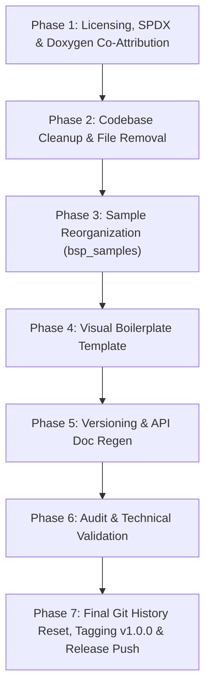

# Clean Slate Release Action Plan: Humid1 OS & ESP32-S3 BSP v1.0.0

This updated action plan establishes the step-by-step roadmap for executing the clean-slate release prep for **Humid1 OS** and the **ESP32-S3 BSP (`esp32_s3_bsp`)**. Execution will proceed incrementally with empirical build verification after every phase, leaving the git history reset and tagging as the final release step.

---

## Executive Summary & Objectives

- **Target Version**: `v1.0.0`
- **Primary Goals**:
  1. **Source & Doxygen Co-Attribution**: Attribution across all `.c`, `.cpp`, and `.h` files for **HUMIDYNE LABS**, **Humiditron**, **Gemini**, and **Waveshare**.
  2. **Licensing Framework**:
     - **Apache 2.0**: Waveshare-derived RTC (`bsp_rtc`), sensor (`bsp_sensors`), and display (`bsp_display`) code.
     - **MIT License**: Core Humidyne OS & BSP code.
     - **Creative Commons Attribution 4.0 International (CC BY 4.0)**: All graphical, font, and SPI Flash assets (`spiflash_assets/`).
  3. **Codebase & File Removal**: Delete `board_manifest.json`, purge backup `bsp_assets.h`/`bsp_assets.c` pair, and clean up temporary build artifacts/hashes.
  4. **BSP Samples Reorganization**: Move examples into `bsp_samples` sub-directories with dedicated `README.md` docs and root `sdkconfig` copies.
  5. **Visual Boilerplate Template**: Implement `examples/boilerplate` with full BSP lifecycle, power button callbacks, and a visible E-Paper UI screen displaying real-time battery voltage, temperature, humidity, RTC time, and button state on boot.
  6. **Version Singleton & API Docs**: Centralize `v1.0.0` in `bsp_version.h`, sync `README.md` and `idf_component.yml`, and regenerate API docs.
  7. **Final Release & Git Reset**: Purge tags, orphan `main` branch to clear commit history, create initial `v1.0.0` commit, tag, and push.

---

## Phase Roadmap



---

## Detailed Execution Phases

### Phase 1: Source Code Licensing, SPDX & Doxygen Attribution (Agenda #3, #3.b, #11)

* **Step 1.1: Waveshare Peripheral Code Licensing (Apache 2.0)**
  - **RTC Driver** (`bsp_rtc.h`, `bsp_rtc.c`): Set license header to `Apache-2.0`. Explicitly attribute Waveshare PCF85063 driver origins.
  - **Sensor Drivers** (`bsp_sensors.h`, `bsp_sensors.c`): Set license header to `Apache-2.0`. Attribute Waveshare SHTC3 / datasheet references.
  - **E-Paper Display Driver** (`bsp_display.h`, `bsp_display.cpp`): Set license header to `Apache-2.0`. Attribute Waveshare 1.54" V2 SPI e-Paper display codebase.

* **Step 1.2: Core Code Licensing (MIT)**
  - All core BSP infrastructure (`bsp.h`, `bsp_lifecycle.*`, `bsp_power.*`, `bsp_button.*`, `bsp_lvgl.*`, `bsp_i2c.*`, `bsp_nvs.*`, `bsp_ota.*`, `bsp_prov.*`, `bsp_splash.*`, `bsp_time.*`, `bsp_wifi.*`, `bsp_tb.*`, `bsp_version.*`) licensed under **MIT License**.

* **Step 1.3: Asset Licensing (CC BY 4.0)**
  - All assets in `spiflash_assets/` and graphical resources explicitly licensed under **Creative Commons Attribution 4.0 International (CC BY 4.0)**.
  - Include `LICENSE-CC-BY-4.0` or update `spiflash_assets/README.md`.

* **Step 1.4: Doxygen Header & SPDX Audit Across All Files**
  - Verify Doxygen headers on **every `.c`, `.cpp`, `.h`** file in `managed_components/esp32_s3_bsp` and `main/`.
  - Format attribution & SPDX tags consistently:
    ```c
    /**
     * @file bsp_xxx.h
     * @brief [Short Description]
     *
     * @version 1.0.0
     * @attribution
     * - Architecture & Development: HUMIDYNE LABS / Humiditron
     * - AI Systems Co-Developer: Gemini (Google DeepMind)
     * - Peripheral Driver Basis: Waveshare Electronics (where applicable)
     *
     * SPDX-License-Identifier: MIT  (or Apache-2.0 for Waveshare peripherals)
     */
    ```
  - Ensure `#ifdef __cplusplus extern "C" {` wrappers exist across all C headers for C++ safety.

---

### Phase 2: Codebase Cleanup & File Removal (Agenda #6, #8)

* **Step 2.1: Remove `board_manifest.json`**
  - Delete loose `board_manifest.json` file from repository root.

* **Step 2.2: Remove Backup Source File Pair (`bsp_assets`)**
  - Delete `managed_components/esp32_s3_bsp/src/bsp_assets.c`
  - Delete `managed_components/esp32_s3_bsp/include/bsp/bsp_assets.h`
  - Remove `bsp_assets.c` from `managed_components/esp32_s3_bsp/CMakeLists.txt` and purge `#include "bsp/bsp_assets.h"` inclusions.

* **Step 2.3: Purge Transient Artifacts & Reset `dependencies.lock`**
  - Delete top-level `build/` directory and `.component_hash` files.
  - Remove/regenerate `dependencies.lock` to ensure clean downstream dependency resolution.

---

### Phase 3: BSP Examples Organization & Sample Cleanliness (Agenda #4, #5, #6)

* **Step 3.1: Reorganize Samples into `bsp_samples`**
  - Move/structure BSP example projects into sub-directory: `examples/bsp_samples/` (or `managed_components/esp32_s3_bsp/examples/bsp_samples/`):
    - `display_epaper` (E-Paper display text & graphics sample)
    - `sensors_rtc` (SHTC3 temperature/humidity + PCF85063 RTC sample)
    - `power_button` (PMIC / Power button lifecycle sample)
    - `lvgl_widgets` (LVGL 9 UI rendering sample)

* **Step 3.2: Standardize Sample Build Files & Configs**
  - Copy root `sdkconfig.defaults` and `sdkconfig` into each sample project directory.
  - Ensure `partitions.csv` is correctly referenced in `sdkconfig.defaults`.
  - Add a clear `README.md` in each sample directory with hardware requirements and compilation commands (`idf.py build flash monitor`).

---

### Phase 4: Production Boilerplate Template Implementation (Agenda #7)

* **Step 4.1: Create `examples/boilerplate` Reference Project**
  - Create a clean standalone starter project in `examples/boilerplate`.

* **Step 4.2: Full BSP Lifecycle & Power Callbacks**
  - In `main/main.cpp` / `main/main.c`:
    - Execute `bsp_init()` for hardware bus, display, NVS, and sensors.
    - Wire power button callbacks:
      - **Short press**: Toggle display inversion / manual refresh.
      - **Long press**: Clean power-down (`bsp_power_off()`).

* **Step 4.3: Visible E-Paper UI Screen & Super Loop**
  - Render a clear on-screen dashboard on boot so the user gets immediate visual feedback after flashing:
    - **Header**: "HUMID1 OS - BOILERPLATE v1.0.0"
    - **Telemetry**: Battery Voltage (V), Temperature (°C / °F), Relative Humidity (%).
    - **Clock**: Current RTC time string.
    - **Status**: Power button state & system uptime.
  - Implement 5-second main loop:
    ```c
    while (1) {
        bsp_sensor_data_t sensor_data;
        bsp_sensors_read(&sensor_data);
        float batt_v = bsp_power_get_battery_voltage();
        
        // Update visible readings on display
        boilerplate_ui_update(batt_v, sensor_data.temp_c, sensor_data.humidity, bsp_button_get_state());
        
        vTaskDelay(pdMS_TO_TICKS(5000));
    }
    ```
  - Exclude ThingsBoard (`bsp_tb`), Cloud, Audio, and Sleep dependencies to ensure instant, lightweight compilation.

---

### Phase 5: Version Standardization & Documentation Update (Agenda #9, #10)

* **Step 5.1: Update Version Singleton**
  - Update `managed_components/esp32_s3_bsp/include/bsp/bsp_version.h`:
    - `#define BSP_VERSION_MAJOR 1`
    - `#define BSP_VERSION_MINOR 0`
    - `#define BSP_VERSION_PATCH 0`
    - `#define BSP_VERSION_STRING "1.0.0"`
  - Sync version `1.0.0` in `managed_components/esp32_s3_bsp/idf_component.yml` and root `README.md`.

* **Step 5.2: Markdown Documentation Audit**
  - Update root `README.md` to reflect `v1.0.0` Clean Slate state.
  - Verify pinout diagrams, component manifests, and build commands.

* **Step 5.3: API Documentation Regeneration**
  - Run Doxygen / docgen tool to produce refreshed API documentation.

---

### Phase 6: Technical Audit & Build Validation (Approved Phase 7 Items)

* **Step 6.1: Full Project Build Verification**
  - Run `idf.py build` on main project and `examples/boilerplate` to verify clean zero-error compilation.
* **Step 6.2: Header & Wrapper Audit**
  - Confirm all headers have `@version 1.0.0`, `SPDX-License-Identifier:`, and C++ `extern "C"` wrappers.

---

### Phase 7: Final Release Prep, Git History Reset & Tagging (Agenda #1, #2, #12, #12.b)

* **Step 7.1: Local & Remote Tag Purge**
  - Delete local tags: `git tag -l | ForEach-Object { git tag -d $_ }`
  - Delete remote tags on GitHub (if any): `git push origin --delete $(git tag -l)`

* **Step 7.2: Orphan `main` Branch & Reset Commit History**
  - Create temporary unparented branch: `git checkout --orphan temp_clean_slate`
  - Stage all clean slate files: `git add -A`
  - Initial clean release commit: `git commit -m "feat(release): initial clean slate release v1.0.0"`
  - Delete legacy `main` branch: `git branch -D main`
  - Rename to `main`: `git branch -m main`

* **Step 7.3: Create Tag `v1.0.0` & Force Push to GitHub**
  - Tag release: `git tag -a v1.0.0 -m "Humid1 OS & ESP32-S3 BSP v1.0.0 Release"`
  - Force push clean `main` branch: `git push -f origin main`
  - Push release tag: `git push origin v1.0.0`

---

> [!NOTE]
> All phases will be executed incrementally in order (Phase 1 through Phase 7). Build verification will occur after each phase.
