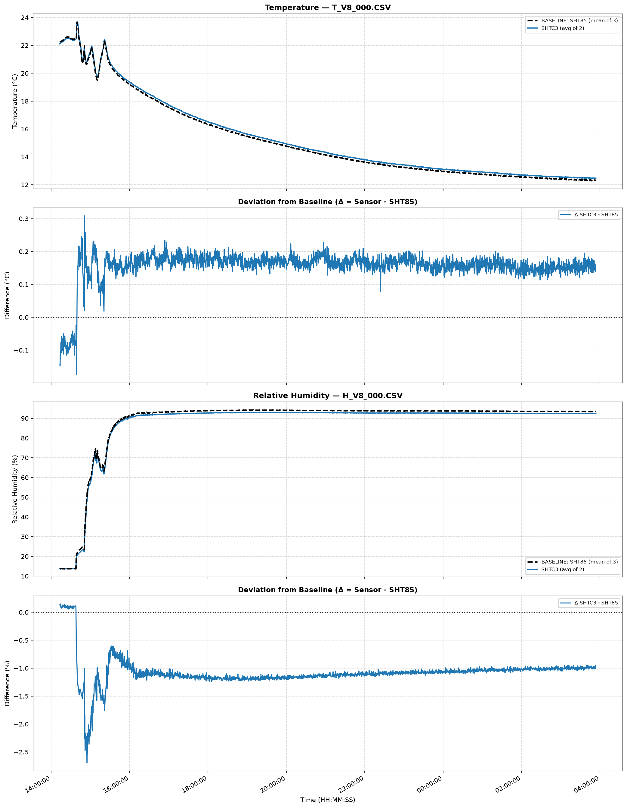

# Sensor Stability and Factory Calibration Discussion

### Inital Unit Test
Within the last 24 hours, I captured a series of basic, ambient, environmental, readings with the SHTC3 sensor. Data observation resulted in the following conclusions, "sensors broke", "codes f-ed", "dev kits broke", "my pants are missing". 

### Data Observations
During basic runtime testing the SHTC3 consistently output readings with a delta far beyond standard operating tolerance. I was observing relitive humidity readings 20% below ambient, temperature readings 15°F above ambient.

### Code Audit
After carful review of the code I've determined that the BSP is error free (in this regard). The algorithm used for converting raw values to standard SI temperature and relitive humidity, is infact the same algorithm outlined in the specification sheet provided by the manufacturer.

### Hardware Inspection
Observing the unpowered hardware under a binocular microscope (10-20x magnification) has revealed no obvious error in manufacturing or defective pertaining to the SHTC3. I can concluded the sensor and development kit are in perfect working order.

### Research on the WWW
I was able to find a dataset that compared the SHTC3 to an array of other environmental sensors of the same class. The data set showed the factory calibration was accurate, and the sensor was able to produce results within the standard operating tolerance with no calibration mechanism in place.

### Preliminary Conclusion and Hypothesis
The unit under test is performing outside the standard error margin. The physical placement of the SHTC3 is near the board edge, away from the boost converter and main microcontroller unit. A thermal relief is present on the board layout, providing further isolation from heat and noise associated with general runtime.

- My sensor 'could' be defective.
- The manufacturing process 'could' have introduced contamination that accumulate on the surface of the sensing element.
- The sensor 'could' be getting too hot under normal operating conditions. The MCU clock speed is 240Mhz, all periferals enabled, current draw was unmeasured, assumed to be "normal" per operating spec.

### Low Power Testing
A new test will be performed in order to observe the effects of 'low power' mode. The unit under test will be placed in a sealed box with a humidification source. Environmental conditions are as follows, environmental temperature 73-75°F, environmental relitive humidity 70% non fluctuating. The unit under test will 'deep sleep' for 60 seconds, publish a reading to the display and resume 'deep sleep'. 

This will hopefully minimize heat disappation and produce a more 'normal' environmental reading. One additional, calibrated, sensor will be added to the enclosure to provide a frame of reference. It is my hope that the observed delta will be within the acceptable margin of error per the device spec. 

*The duration of the test is directly dependent on the duration of today's nap*. Recommend test duration is 2-4 human hours.

---

[Source of Independent 3rd Party Dataset](https://wiki.liutyi.info/display/ARDUINO/v8+Sensors+Board)

